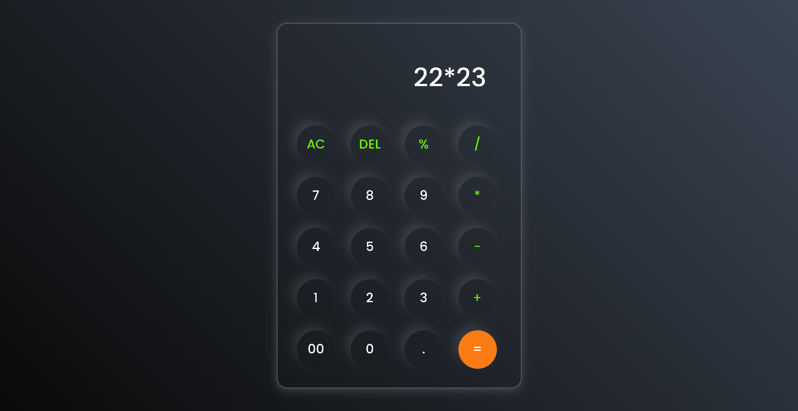

# 📱 Calculator Project

Welcome to the **Calculator Project**! 🎉 This project showcases basic arithmetic operations using HTML, CSS, and JavaScript. It's a great starting point for beginners looking to practice their front-end development skills.

## 🛠️ Features

- **Addition (+)**: Add numbers together
- **Subtraction (-)**: Subtract one number from another
- **Multiplication (*)**: Multiply numbers
- **Division (/)**: Divide one number by another
- **Percentage (%)**: Calculate percentage values
- **Clear (AC)**: Reset the calculator
- **Delete (DEL)**: Remove the last character
- **Decimal (.)**: Add decimal points
- **Equals (=)**: Compute the result

## 🔢 Button Layout

Here's the layout of the calculator buttons:

```
AC  DEL  %  /
7   8   9  *
4   5   6  -
1   2   3  +
00  0   .  =
```

## 📸 Calculator Preview

 


## 🧩 Code Overview

- **HTML (`index.html`)**: Provides the structure of the calculator.
- **CSS (`style.css`)**: Adds styling and layout to the calculator.
- **JavaScript (`script.js`)**: Implements the functionality and logic.

## 🎨 Styling

The calculator features a clean and modern design with rounded buttons and a sleek background. Colors and shadows enhance the visual appeal.


## 👥 Author

**Saket Chaudhary**

